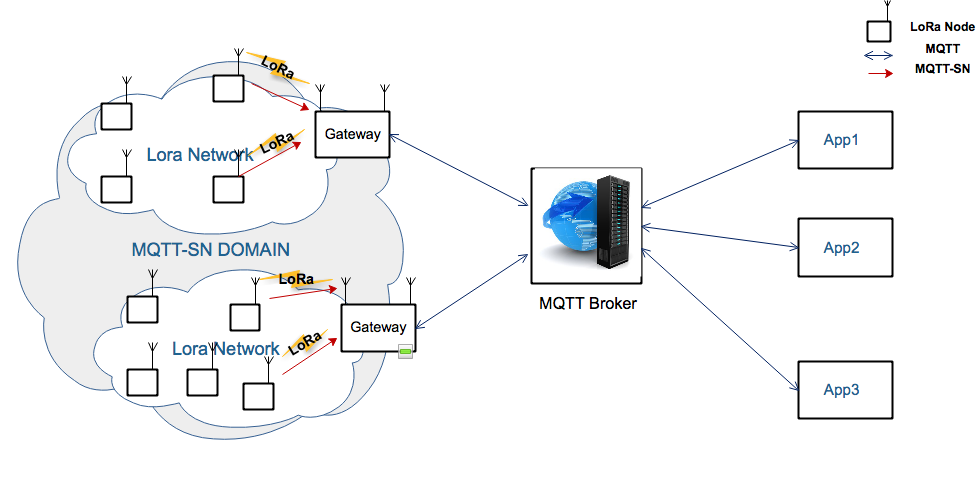

# mqtt-sn-over-lora-communication
the mqttsn protocol on the wireless sensor network based on lorawan On this works, we build mqttsn packet on arduino(test on Arduino Mega) and send it over LoRaWAN network. For the reception, we have dragino LoRaGateway witch after receive the mqttsn packet, transforme it to mqtt packet using PubSubClient(arduino library) and send it to the broker

## Architecure

